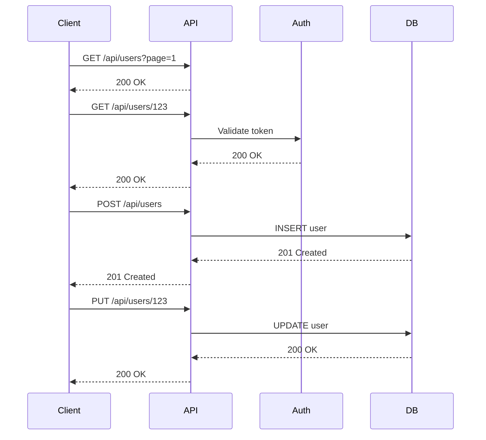

The **Visualize Flows** feature generates interactive sequence diagrams from discovered API activity. Use it to understand request/response order, show component interactions, and create shareable diagrams for documentation, onboarding, or architecture reviews.

---

- Converts discovered endpoints and request/response sequences into readable sequence diagrams.
- Supports multiple precomputed or user-defined flows (e.g., User Management, Checkout Flow).
- Provides both a **Diagram** view and a **Script** view (Mermaid or similar).
- Export options: **Open in Mermaid Playground**, **Download PNG**, **Download SVG**.

---

## UI Components

### Flow Selector
- A dropdown to select which flow to visualize.
- Each flow has a title and a brief description.
- Useful when your project has several distinct workflows to inspect.

### Flow Card / Metadata
- Shows the selected flow’s title and short description.
- Acts as a quick reminder of what the visualized flow represents.

### Diagram / Script Tabs
- **Diagram tab:** renders the visual sequence diagram.
- **Script tab:** shows the underlying diagram script that can be copied or edited.

### Theme Toggle
- Switch diagram canvas between light/dark modes for readability or presentations.

### Export & Integration Buttons
- **Open in Mermaid Playground:** opens the diagram script in an online Mermaid editor for quick live editing.
- **Download PNG:** export the rendered diagram as a PNG image.
- **Download SVG:** export the diagram as scalable vector graphics.

---

## Diagram Details

The sequence diagram typically contains:

- **Participants** (lifelines): logical actors such as `Client`, `API`, `Auth Service`, `Database`.
- **Request arrows:** labeled with method and path (e.g., `GET /items`, `POST /users`).
- **Response arrows:** show return status or result (e.g., `200 OK`, `201 Created`) — sometimes rendered as dotted lines.
- **Action boxes / annotations:** describe business-level actions (e.g., "Create user", "Validate token").
- **Ordering / timing:** top-to-bottom chronological order showing the sequence of interactions.

### Interpreting a Diagram
- Read top-to-bottom: the earliest calls are near the top.
- Follow arrows left-to-right for direction of calls; return arrows indicate responses or callbacks.
- Use action annotations to understand the intent behind the HTTP call.

---

## Script View & Editing

- The **Script** tab exposes the diagram definition (commonly Mermaid).
- You can copy the script to:
  - Edit in the app (if supported) and re-render, or
  - Open it in **Mermaid Playground** to refine styling and layout.

---

## Multiple Flows

- The system can store and visualize multiple flows.
- Flows can represent different user journeys, microservice interactions, or grouped sequences.
- Select a flow from the dropdown to switch context and re-render the diagram.

---

## Export & Use Cases

- **PNG / SVG exports** — include diagrams in documentation, presentations, or design reviews.
- **Mermaid script** — commit to repository docs for automatic rendering in Markdown-based doc systems.
- **Open in Mermaid Playground** — tweak visuals & save updated scripts.

---

## Example Mermaid Script (User Management Workflow)

> This sample shows a typical user lifecycle flow — listing users, reading details, creating and updating a user.

---

## Best Practices

- Create separate flows for major use cases (e.g., authentication, user lifecycle, checkout).
- Include both success and error scenarios so diagrams reflect realistic interactions.
- Keep scripts editable and version-controlled (store Mermaid scripts in the docs repo).
- Use annotations in the script to show important business logic or side-effects.

---

## Troubleshooting & Tips

- **Flow appears incomplete:** ensure logs/samples contain full request/response traces and that endpoints are included in the flow generation input.
- **Diagram too dense:** break large flows into smaller subflows or use paging in logs to limit the time window.
- **Incorrect sequence:** verify timestamps in input logs are accurate and time-synced across services.

---

## Next Steps

- Export diagrams to include in architecture docs.
- Iterate on Mermaid script and save improved versions back into the flow library.
- Use flow visualizations in design reviews, onboarding, and incident postmortems.

